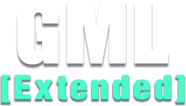

  

# GameMaker Language Extended
## A GameMaker extension to complement GameMaker Studio 2.3+ built-in functions.
### Last updated: 2022-11-12

### Author & Collaborators
Originally created by [**@DAndrewBox**](https://twitter.com/DAndrewBox_).

Collaborators:

### Special Thanks
- [**YoYo Games**](https://www.yoyogames.com/) for creating GameMaker.
- [**Xot**](https://twitter.com/xotmatrix) for a way to get the [unix timestamp](https://www.gmlscripts.com/script/unix_timestamp) used as a base for the `lib_time`.
- [**Shaun Spalding**](https://twitter.com/shaunspalding) for the original `array_shuffle` script.

---

### Table of Contents
- [Installation](#installation)
- [Documentation](#documentation)
- [Contributing](#contributing)
- [License](#license)

---

### Installation
1. Download the latest release from the [releases page](#).

2. (A) Import the contents into your project just draggin the `gml-extended-[version].yymps` file into it. 

2. (B) You can also import it into your project using the top toolbar on Tools > Import Local Package > Select the `gml-extended-[version].yymps` file.

---

### Documentation
The documentation is also available in the `Docs` folder of this repository or pressing the links below.
- [**Arrays**](Docs/Arrays.md)
- [**Files**](Docs/Files.md)
- [**HTTP**](Docs/HTTP.md)
- [**Logger**](Docs/Logger.md)
- [**Math**](Docs/Math.md)
- [**Server (TCP)**](Docs/ServerTCP.md)
- [**Shaders**](Docs/Shaders.md)
- [**Sprites**](Docs/Sprites.md)
- [**Strings**](Docs/Strings.md)
- [**Structs**](Docs/Structs.md)
- [**Surfaces**](Docs/Surfaces.md)
- [**Time**](Docs/Time.md)

---

### Contributing
If you want to contribute to this project, you can do so by forking this repository and submitting a pull request.

---

### License
This project is licensed under the MIT License. See the [LICENSE](LICENSE) file for more details.

---